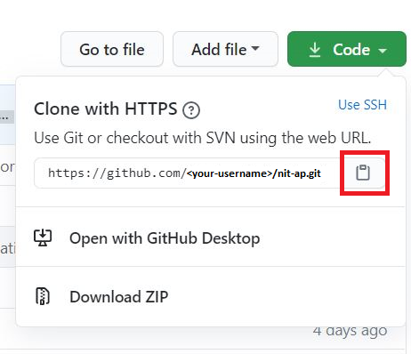
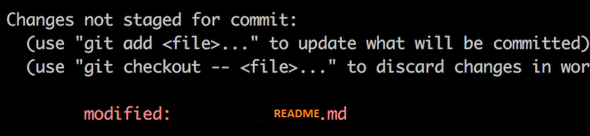
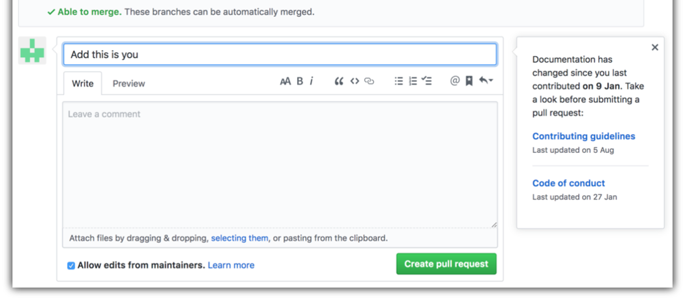

If you don't have git on your machine, [install it]( https://help.github.com/articles/set-up-git/).

## ✨Fork this repository
Fork this repository by clicking on the fork button on the top of this page.
This will create a copy of this repository in your account.

## ✨Clone the repository

Now clone the forked repository to your machine. Go to your GitHub account, open the forked repository, click on the clone button and then click the *copy to clipboard* icon.
Open a terminal and run the following git command:

```
git clone "url you just copied"

```
where "url you just copied" (without the quotation marks) is the url to this repository (your fork of this project). See the previous steps to obtain the url.

For example:

```
git clone https://github.com/this-is-you/first-contributions.git

```
where `this-is-you` is your GitHub username. Here you're copying the contents of the first-contributions repository on GitHub to your computer.

## ✨Create a branch
Change to the repository directory on your computer (if you are not already there):

```
cd first-contributions

```
Now create a branch using the `git checkout` command:

```
git checkout -b <add-your-new-branch-name>

```

For example:
```
git checkout -b suubh-contribution

```

## ✨Make necessary changes and commit those changes

Now open `README.md` file in a text editor, add your name to it by making the following changes -
```
<li><a href="your-github-link">Your-name</a></li>

```
For eg-
```
<li><a href="https://github.com/suubh">Shubham Singh</a></li>

```
 Now, save the file.



If you go to the project directory and execute the command `git status`, you'll see there are changes.

Add those changes to the branch you just created using the `git add` command:

```
git add README.md

```
Now commit those changes using the `git commit` command:

```

git commit -m "Add <your-name> to Contributors list"


```

replacing `<your-name>` with your name.


## ✨Push changes to GitHub

Push your changes using the command `git push`:

```
git push origin <add-your-branch-name>

```
replacing `<add-your-branch-name>` with the name of the branch you created earlier.


## ✨Submit your changes for review


If you go to your repository on GitHub, you'll see a  `Compare & pull request` button. Click on that button.


Now submit the pull request.




Soon I'll be merging all your changes into the master branch of this project. You will get a notification email once the changes have been merged.
## 👋Organised by Shubham Singh.