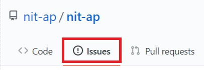
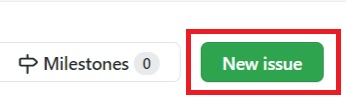
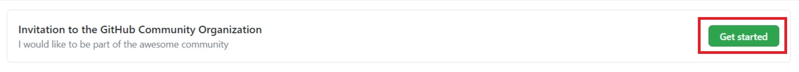
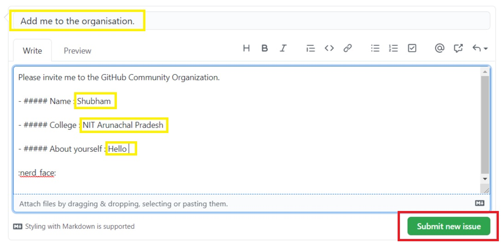

# Follow the ordered steps.

## ⚡Open the repository and click on Issues.

  

## ⚡Create a new Issue.

  

## ⚡Choose the template.

Choose the template "Invitation to the GitHub Community Organization" and click on Get Started.

## ⚡Fill your details.
Now fill the required details and click on Submit . 
The GitHub action will work and after sometime bot will close your issue with a message to check your mail .

  

## ⚡Check your mail and accept the invitation to join the community.

## ⚡Set the organization to public.
<ul>
  <li>Navigate to our community page: https://github.com/nit-ap</li>
  <li>Click on the highlited area:</li>
  <li>Enter your username in the highlighted searchbar:</li>
  <li>Click Private (the default) and set it to Public</li>
</ul>

## 👋Organised by [Shubham Singh](https://github.com/suubh).
