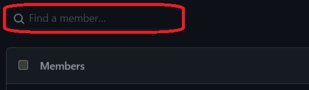

# Follow the ordered steps.

## ⚡Open the repository and click on Issues.

  

## ⚡Create a new Issue.

  

## ⚡Choose the template.

Choose the template "Invitation to the GitHub Community Organization" and click on Get Started.

## ⚡Fill your details.
Now fill the required details and click on Submit . 
The GitHub action will work and after sometime bot will close your issue with a message to check your mail .

  

## ⚡Check your mail and accept the invitation to join the community.

## ⚡Set the organization to public.

  ##### 💬 Navigate to our community page: https://github.com/nit-ap
  ##### 💬 Click on the highlighted area:

  

  
  
  
  
  ##### 💬 Enter your username in the highlighted searchbar:

  

  ##### 💬 Click Private (the default) and set it to Public.

  

## 👋Organised by [Shubham Singh](https://github.com/suubh).
